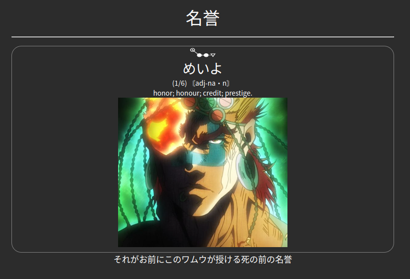

# Mining Deck Template
A basic functional Anki deck template for Japanese language learning.



## Features
- Requires zero editing of Yomichan templates (handlebars)
and should therefore no longer break on Yomichan updates.
- Determines whether the expression matches the reading and 
if it does, puts the example sentence on the front of the 
card as recommended by [Animecards](https://animecards.site).  
- Automatically formats the HTML created by Yomichan to
create switchable definitions using the arrow keys or click/touch. If you see something
like `(1/6)` at the start of the card, it means there are 6 definitions, through
which you can scroll by clicking on the definition or using the arrow keys. The first
definition should be the most relevant one, as you shouldn't be switching during reviews.
- Sets a few fallback fonts so there is no possibility of Chinese being displayed.
- Should work on all devices. If it doesn't look good on your device, 
feel free to make a PR.
- Hides the main image on mobile, so you don't go around showing off your Anime :). See
below for a way to remedy this.

## Yomichan Fields
| Anki Field    | Yomichan Template        | 
|---------------|--------------------------|
| Word          | {expression}             | 
| Reading       | {reading}                |
| Glossary      | {glossary-no-dictionary} |
| Sentence      | {clipboard-text}         |
| Picture       |                          |
| Audio         | {audio}                  |
| SentenceAudio |                          |
| Graph         | {pitch-accent-graphs}    |
| Hint          |                          |

## Direct Download
See releases.

## How to update
Open a card with the corresponding template in Anki. 

Then `Edit` > `Cards...`

Go to repository directory AnkiFields and copy the text from `front.html` to `Front`,
from `back.html` to `Back` and from `styling.css` to `Styling`.

If you changed field names to something else, you will have to make changes to the
corresponding text in the files.

## How to restore images on mobile
Delete the following lines from the `Styling` section of your card:

```css
.iphone .main_image {
    display: none;
}

.mobile .main_image {
    display: none;
}
```